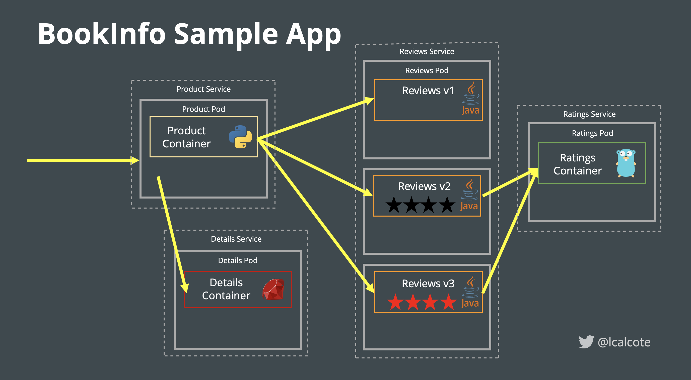

# Capstone 

## Introduction

The purpose of a capstone project is to demonstrate your mastery of implementing the GitSecOps pipeline in a more practical setting.  This may require you to conduct additional research and will definitely require you to synthesize and integrate the skills and knowledge they have gained throughout this workshop.  Additionally, completing this capstone project will prepare you to give back to the GitSecOps by preparing you to participate in the next level of the workshop( Explorations)  
 

#### Bookinfo Application
The BookInfo application is at the heart of the Capstone project.  It is a simple web application that displays information about a book, including its title, author, and publication date. It is built using a microservices architecture and includes several independent components that work together to deliver the functionality. 

{ width="800" height="600" style="display: block; margin: 0 auto" }

??? Harma "BookInfo application additional details"

    The application was created as a way to demonstrate the use of microservices and how they can be used to build scalable and resilient applications. In this introduction, we will provide an overview of the components of the BookInfo application and explain how they fit together to form the overall application. We will also discuss some of the key concepts and technologies used in the application, including microservices, containers, and Kubernetes.

    The BookInfo application is built using a microservices architecture, which means that it is composed of a set of independent, modular services that communicate with each other to deliver the desired functionality. Here is a list of the components that are included in the BookInfo application:

    * Product Catalog Service: This service stores a list of books and their associated information, such as title, author, and publication date.

    * Rating Service: This service stores ratings and reviews for books.

    * Details Service: This service retrieves information about a specific book from the Product Catalog Service and retrieves ratings and reviews for the book from the Rating Service. It then combines this information and returns it to the user.

    * Review Service: This service retrieves ratings and reviews for books from the Rating Service and displays them to the user.

    * Web UI: This is the user interface for the BookInfo application. It allows users to browse and search for books, view detailed information about a particular book, and rate and review books.

    In addition to the core BookInfo application, there are also several additional components that are used to demonstrate various concepts and capabilities. For example, there is a version of the application that includes an additional service that demonstrates how to use an external database to store data. There is also a version that includes a load balancer and demonstrates how to route traffic to different versions of a service.

## Requirement
You must design and deploy (locally or in cloud) an end-to-end Kubernetes application based on the BookInfo application using the GitSecOps pipeline built throughout this workshop  At a high-level, this project should implement the following:

- A forked/clone repo of the BookInfo application
- A threat model (optional)
- Documented in a git repository in a repeatable fashion
- Deploy a Tekton pipeline that automates the build and deployment of the application in a declarative deployment approach (e.g. ArgoCD) 
- Implements security testing and validation at all stages of the pipeline
- Add one unique aspect to your architecture (e.g service mesh, artifact server, external secrets management).  You can use an existing exploration or create a new one.
- A reflection 

## Completing the reflection
A reflection is for yourself and does not have to be provided to anyone, but it can be useful to complete one to really to solidify your learning. You may choose the format for your reflection. Possible formats include:
* Written essay
* Video
* Interview (record on video)
* Digital Presentation (prezi, Google slides, etc.)
* Mindmap

Some sample questions you can ask yourself include but are not limited to:

1. What process did you go through to produce the exploration? Did everything work the way you had planned?
2. What lessons did you learn? Describe your successes and frustrations.
3. What new skills did you learn while doing this work?
4. Did you have any interesting or unique experiences while completing your exploration?
5. What part of your exploration are you most proud of, and why?
6. What was the hardest part of doing this exploration? What were your challenges?
7.  What mistakes did you make, and what did you do to limit the impact or shift your course?
8.  What kinds of support could you have used during the process?
9.  If you could do anything about the exploration over again, what, if anything, would you change?
10. What advice would you give to other readers who are preparing to embark on the capstone process?

