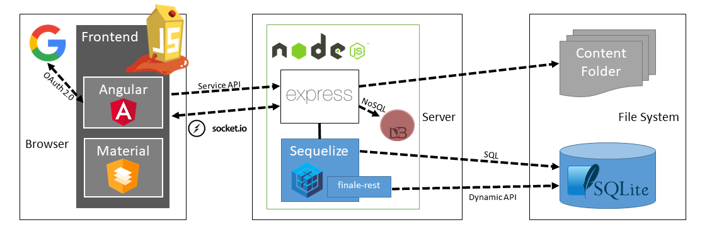

# 1.Local Application

## Introduction

For a start, we will install JuiceShop locally and interact with it as a "traditional" application without the context of containers or microservices.  This will allow us to become familiar with the application from the ground up.  It will also let us lay the foundation for the tooling required for the appropriate security testing level. 

Here is a brief overview of the application we will use



We suggest that you Walk the happy path before getting started - https://pwning.owasp-juice.shop/part1/happy-path.html

A big focus of this section is understanding the importance of security scanning your container images.  Security scanning container images involves checking the image for known vulnerabilities and compliance issues.  This can be done at several levels:

* With standalone container scanning using ooling like Aqua Security, Snyk, and Anchore.
* With traditional vulnerability scanning tools like Nessus, OpenVAS, and Qualys.
* Using built-in scanning capabilities in Image registries such as DockerHub, Quay, and Harbor.

These tools and services check the image for known vulnerabilities in the operating system and application dependencies, as well as for compliance with security standards and best practices.  They also check for any sensitive information or misconfigurations in the image that could compromise the container environment's security. 

It is important to note that security scanning is not a one-time process.  It should be done regularly, especially when new version of the images are pushed to the registry.

For now, you can dump all the analysis into a folder called outputs (e.g. /tmp/juice/outputs).  In the future, we will redirect outputs to a system that can aggregate, enrich, and normalize the findings.  We will not do anything with these findings now, but reviewing them is a good idea so you can understand the outputs.

## Supplementary Learning Material

<iframe width="1120" height="630" src="https://www.youtube.com/embed/jgzjX6FBtBo" title="YouTube video player" frameborder="0" allow="accelerometer; autoplay; clipboard-write; encrypted-media; gyroscope; picture-in-picture; web-share" allowfullscreen></iframe>

#### Additional Links:

* The OWASP Juiceshop project - <https://owasp.org/www-project-juice-shop/>
* Hacking Juiceshop the DevSecOps way - <https://www.omerlh.info/2018/12/23/hacking-juice-shop-the-devsecops-way>   
* Pwning Juiceshop - <https://pwning.owasp-juice.shop/> 
* Learning SemGrep -<https://semgrep.dev/learn>
* Semgrep and Juiceshop - <https://www.linkedin.com/pulse/brief-semgrep-analyse-juice-shop-bar%C4%B1%C5%9F-ekin-y%C4%B1ld%C4%B1r%C4%B1m>
* Semgrep Introduction -<https://payatu.com/blog/vishnu.k/semgrep-introduction>
* Snyk and Juiceshop - <https://gitlab.com/snyk-rfrazier/juice-shop>
* NMAP - <https://www.edureka.co/blog/nmap-tutorial/>
* Nikto - <https://techyrick.com/nikto-2/>
  
## Scenario

1. Install Juice Shop Locally 
2. Complete a secure static code analysis with SemGrep 
3. Run a software composite analysis with Snyk 
4. Run Git secret analysis with Gitleaks 
5. Run Infrastructure scan (port) with NMAP
6. Run Web scan with Nikto 

**Solution** 

??? solve "Solution"

    1.Install JuiceShop locally.

    ```
    # Make sure node is installed

    $ git clone https://github.com/juice-shop/juice-shop.git --depth 1
    $ cd juice-shop
    $ npm install
    $ npm start 

    # Browse to http://localhost:3000 
    # Take sometime to walk the happy path - https://pwning.owasp-juice.shop/part1/happy-path.html
    ``` 

    2.Complete a secure static code analysis with SemGrep

    ```
    # Set-up a file structure to handle tests.  These can be anywhere/anything.
    $ mkdir /tmp/juice && mkdir /tmp/juice/outputs 

    # Git Clone Juiceshop to testing folders 
    $ cd /tmp/juice
    $ git clone git@github.com:juice-shop/juice-shop.git
    $ cd juice-shop

    # Run  basic Semgrep analysis
    $ docker run --rm -v "${PWD}:/src" returntocorp/semgrep semgrep --config=auto | tee /tmp/juice/outputs/semgrep.txt
    ```


    3.Run a software composite analysis with Snyk
    Snyk is not opensource. However, they do have a free tier that you can use once you sign-up.

    ```
    # Make sure you are in the Juice-shop dir that you cloned earlier
    $ CD /tmp/juice/juice-shop 
    $ snyk test | tee /tmp/juice/outputs/snyk.txt
    ```

    4.Run Git secret analysis with Gitleaks 

    ```
    $ docker pull zricethezav/gitleaks:latest
    $ docker run -v ${path_to_host_folder_to_scan}:/path zricethezav/gitleaks:latest [COMMAND] --source="/path" [OPTIONS]

    ```


    5.Run Infrastructure scan (port) with NMAP

    ```
    # Of course, there are better tools (e.g. ZAP) but this will give you the rough idea of how to run an infrastructure scan
    $ docker pull instrumentisto/nmap
    $ docker run --rm -it instrumentisto/nmap -A -T4 scanme.nmap.org | tee /tmp/juice/outputs/nmap.txt

    ```

    6.Run Web scan with Nikto 

    ```
    # Of course, there are better tools (e.g. ZAP) but this will give you the rough idea of how to run a web scan
    $ docker pull frapsoft/nikto
    $ docker run frapsoft/nikto -host https://example.com | tee /tmp/juice/outputs/nikto.txt

    ```

## Additional Challenges
1. **PWN OWASP JuiceShop!** - Complete all the tasks and challenges to completely hack the JuiceShop.  Here is your inspiration https://pwning.owasp-juice.shop/
2. **Semi-automated security check** - Write a Bash file that semi-automates the security check process used in this scenario. 
