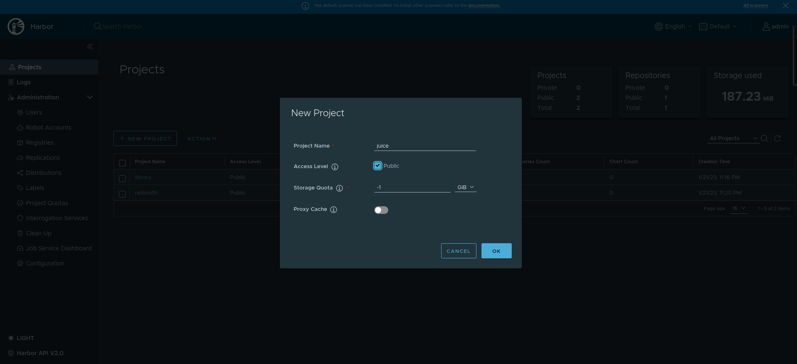
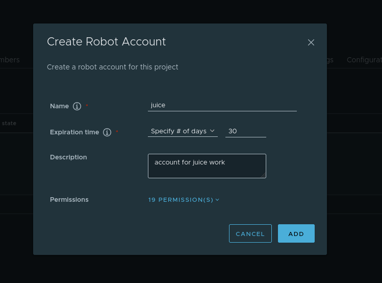
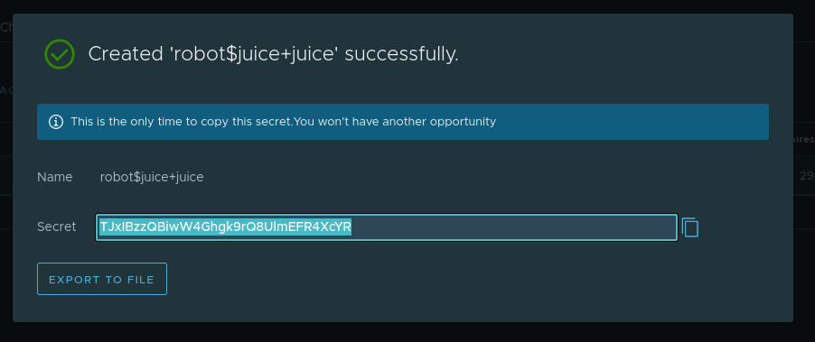
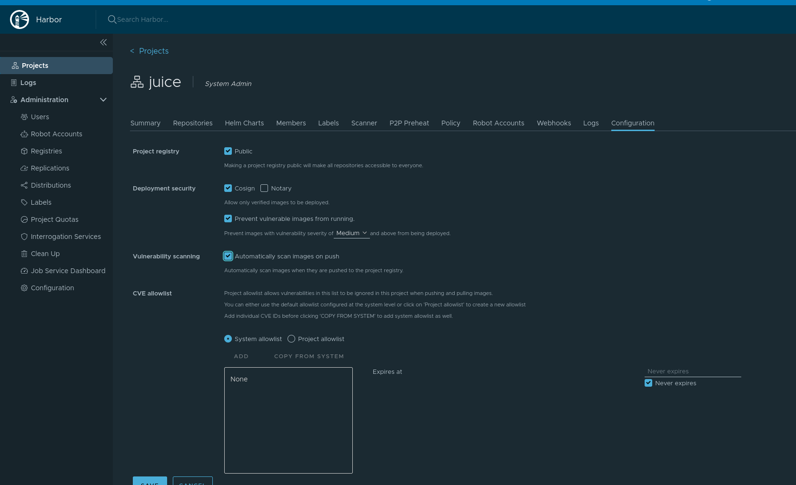

# 3.Image Verification in K8s

## Introduction 

We will use Kyverno to validate that only signed images are deployed to Kubernetes.  Kyverno is an open-source policy engine for Kubernetes that allows you to define and enforce policies across your entire cluster. It allows you to define policies using Kubernetes native resources, such as ConfigMaps and Custom Resources, and it can be used to validate, mutate, and generate resources based on those policies. Kyverno provides a robust set of features for policy management, including:

* Policy validation: Kyverno allows you to define validation policies that can be used to check that resources conform to your desired state.
* Policy mutation: Kyverno allows you to define mutation policies that can be used to automatically modify resources as they are created or updated.
* Policy generation: Kyverno allows you to define generation policies that can automatically generate new resources based on existing resources.

Here's an example of how you could use Kyverno to enforce the use of signed images:

* Create a policy that defines the validation rules for image signatures. This policy could check for the presence of a signature and verify that the signature is valid and was created by a trusted source.
* Apply the policy to the relevant resources in the cluster. For example, you could apply the policy to all pods or deployments, or you could apply it to specific namespaces or labels.
* Implement the policy by creating a Kyverno admission webhook. This webhook will intercept all requests to create or update resources in the cluster and apply the policy to ensure that only signed images are allowed to run.
* Configure your image registry to provide the signature information for images that are pushed to it.

Once this policy is in place, any attempt to deploy an unsigned image will be rejected by the Kyverno admission webhook, ensuring that only signed images can run in the cluster.

We are also going to explore security mechanisms that can be used on the container registry to further enhance the security of the GitSeCOps process.  In this particular case, we will use a local instance of Harbor to demonstrate best practices. 

------------------------------------------------------------------------------------------------

## Supplementary Learning Material

<iframe width="1120" height="630" src="https://www.youtube.com/embed/M_-r6vUKevQ" title="YouTube video player" frameborder="0" allow="accelerometer; autoplay; clipboard-write; encrypted-media; gyroscope; picture-in-picture; web-share" allowfullscreen></iframe>


* Harbor - <https://goharbor.io/>
* kind and Ingress - <https://kind.sigs.k8s.io/docs/user/ingress/>
* Local Harbor Install <https://serverascode.com/2020/04/28/local-harbor-install.html>
* Triy & Harbor - <https://artifacthub.io/packages/helm/trivy-operator/harbor-scanner-trivy/0.28.0>
* Kubernetes Namespaces <https://www.aquasec.com/cloud-native-academy/kubernetes-101/kubernetes-namespace/>
* Kubens and Kubectx  for nmespace/cluster management - <https://github.com/ahmetb/kubectx>
* Harbor and Helm - <https://itnext.io/need-a-container-image-registry-and-helm-chart-repository-go-harbor-b0c0d4eafd3b>
* Harbor and Helm <https://mannimal.blog/2019/07/31/using-harbor-and-kubeapps-to-serve-custom-helm-charts/>
* Kyverno and Cosign - <https://neonmirrors.net/post/2022-05/harbor-cosign-and-kyverno/>
* Kyverno, Harbor, and Cosign - <https://itnext.io/supply-chain-security-with-cosign-and-kyverno-for-on-premise-kubernetes-2fa40ceef3c0>
* Kyverno and cosign - <https://technologyconversations.com/2022/10/10/signing-and-verifying-container-images-with-sigstore-cosign-and-kyverno/>
* Kyverno - <https://rcarrata.com/kubernetes/sign-images-1/>

---------------------------------------------------------------------------------------

## Scenario 

1. Create Kind cluster with NGNIX  Support 
2. Install Harbor (make sure to enable support for Trivy)
3. Create new project called juice (easiest to do via the GUI)
4. Use Docker Client to push juiceshop to Harbor
5. Try Pulling Juice Image from Harbor
6. Upload Juice Helm Chart to Harbor
7. Sign Image with Cosign 
8. Use Kyverno to block deploying unsigned image to Kubernetes


??? solve "Solution"

      1.0 Create Kind cluster with NGNIX  Support  


      1.1 Install Kind with Ingress Support

      ```
      $ cat <<EOF | kind create cluster --name juice --config=-
      kind: Cluster
      apiVersion: kind.x-k8s.io/v1alpha4
      nodes:
      - role: control-plane
        kubeadmConfigPatches:
        - |
          kind: InitConfiguration
          nodeRegistration:
            kubeletExtraArgs:
              node-labels: "ingress-ready=true"
        extraPortMappings:
        - containerPort: 80
          hostPort: 80
          protocol: TCP
        - containerPort: 443
          hostPort: 443
          protocol: TCP
      EOF
      ```

      1.2 Install Ingress 

      1.21. If using Ngnix (Note some have reported error when using NGNIX)

      ```
      $ kubectl apply -f https://raw.githubusercontent.com/kubernetes/ingress-nginx/main/deploy/static/provider/kind/deploy.yaml
      ```

      1.2.2 If using Contour

      ```
      $ kubectl apply -f https://projectcontour.io/quickstart/contour.yaml
      $ kubectl patch daemonsets -n projectcontour envoy -p '{"spec":{"template":{"spec":{"nodeSelector":{"ingress-ready":"true"},"tolerations":[{"key":"node-role.kubernetes.io/master","operator":"Equal","effect":"NoSchedule"}]}}}}'
      ```

      2.0 Install Harbor (make sure to enable support for Trivy)


      2.1 Add Harbor Helm repo and install 
      ```
      $ helm repo add harbor https://helm.goharbor.io

      # Install in separate namespace
      $ helm install local-harbor harbor/harbor \
        --create-namespace \
        --namespace harbor \
        --set clair.enabled=false \
        --set trivy.enabled=true

      # Or install in same namespace
        $ helm install local-harbor harbor/harbor --set clair.enabled=false --set trivy.enabled=true
      ```

      2.2 Accessing the site 

      ```
      # Final configd
      - Add pointer 127.0.0.1 core.harbor.domain /etc/hosts
      - Browse https://core.harbor.domain Must access via https or login will fail
      - login: admin password: Harbor12345
      ```

      3.0 Create a new project via the gui

      3.1 Create New Project

      

      3.2 Add Robot Account 

      

      3.3 Capture Robot Account Secret

      

      3.4 Set Policy to scan on push and prevent deployment of vulnerable images 

      


      4.0 Use Docker Client to push Juiceshop to Harbor

      ```
      $ docker login username (will prompt for password use your harbor one or robot account )
      $ docker pull bkimminich/juice-shop
      $ docker tag bkimminich/juice-shop core.harbor.domain/juice/juice:v1
      $ docker push core.harbor.domain/[projectname]/juice:v1
      ```

      5.0 Try Pulling Juice Image from Harbor

      ```
      $ docker pull core.harbor.domain/juice/juice:v1      

      Error response from daemon: unknown: current image with 52 vulnerabilities cannot be pulled due to configured policy in 'Prevent images with vulnerability severity of "Low" or higher from running.' To continue with pull, please contact your project administrator to exempt matched vulnerabilities through configuring the CVE allowlist.

      ```

      6.0 Upload Juice Helm Chart to Harbor 


      6.1 Fetch Helm Chart
      ```
      $ helm fetch juice/juice-shop 
      ```

      6.2 Upload via GUI

      ```
      -Upload via GUI

  
      ```


      7.0 Sign image with cosign
         
      7.1 Install cosign
      ```
      # binary
      $ wget "https://github.com/sigstore/cosign/releases/download/v1.6.0/cosign-linux-amd64"
      $ mv cosign-linux-amd64 /usr/local/bin/cosign
      $ chmod +x /usr/local/bin/cosign

      # rpm
      $ wget "https://github.com/sigstore/cosign/releases/download/v1.6.0/cosign-1.6.0.x86_64.rpm"
      $ rpm -ivh cosign-1.6.0.x86_64.rpm

      # dkpg
      $ wget "https://github.com/sigstore/cosign/releases/download/v1.6.0/cosign_1.6.0_amd64.deb"
      $ dpkg -i cosign_1.6.0_amd64.deb


      ```

      7.2 Generate key pair

      ```
      $ cosign generate-key-pair

      ```

      7.3 Sign image and verify signature

      ```
      $ cosign sign --key cosign.key --allow-insecure-registry core.harbor.domain/juice/juice:v1 
      $ cosign triangulate --allow-insecure-registry core.harbor.domain/juice/juice:v1
      $ cosign verify --allow-insecure-registry core.harbor.domain/juice/juice:v1 --key cosign.pub


      ```

      8.0 Use Kyverno to block deploying unsigned image to Kubernetes

      Note you may want to switch to dockerHub and use a docker image to complete this the cosign embedded with Kyverno does not support self-signed certs and it can be tricky to workaround it.

      8.1 Install Kyverno

      ```
      $ helm repo add kyverno https://kyverno.github.io/kyverno/
      $ helm repo update
      $ helm install kyverno kyverno/kyverno -n kyverno --create-namespace
      ```

      8.2 Implement Kyverno Policy

      ```
      work in progress . . .


      ```

------------------------------------------------------------------------

## Additional Challenges

1. **Use Clair instead of Trivy** - Change the default scanner to Clair or another scanning engine
2. **Add certs to Harbor** - Set-up Harbor so that it uses proper certs and TLS 


